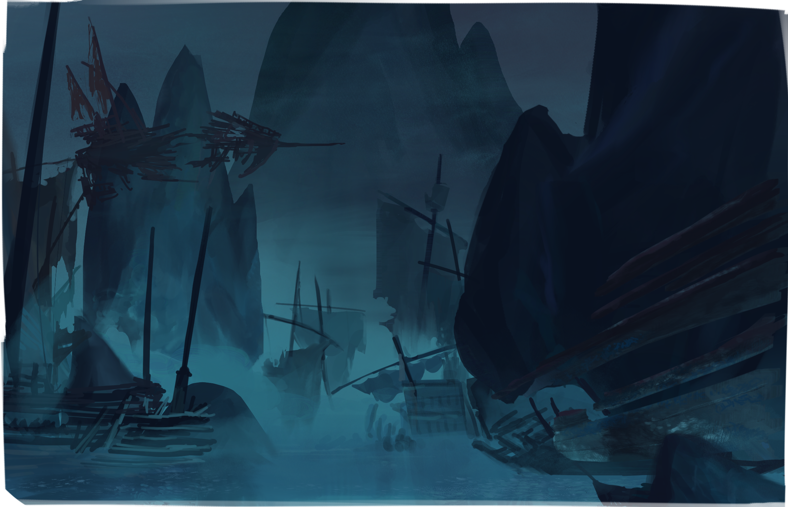

Movie titles are reported in each image description








	
  
  
  
  
2024 - Sinbad: Legend of the Seven Seas, a 2003 American animated film produced by DreamWorks Animation and distributed by DreamWorks Pictures.

  












